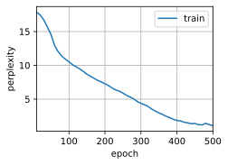
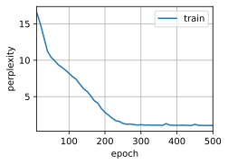

[TOC]


### LSTM 模型

#### 什么是 LSTM ?

长短期记忆网络——通常被称为 LSTM，是一种特殊的 RNN，能够学习长期依赖性。由 Hochreiter 和 Schmidhuber（1997）提出的，并且在接下来的工作中被许多人改进和推广。LSTM 在各种各样的问题上表现非常出色，现在被广泛使用。

LSTM 被明确设计用来避免长期依赖性问题。长时间记住信息实际上是 LSTM 的默认行为，而不是需要努力学习的东西！

所有递归神经网络都具有神经网络的链式重复模块。在标准的 RNN 中，这个重复模块具有非常简单的结构，例如只有单个 tanh 层。


LSTM 也具有这种类似的链式结构，但重复模块具有不同的结构。不是一个单独的神经网络层，而是四个，并且以非常特殊的方式进行交互。


#### LSTM 的核心思路


LSTM 的关键思想是网络可以学习长期状态下存储的内容、丢弃的内容以及从中读取的内容。当长期状态 $c_{t-1}$ 从左到右遍历网络时，它首先经过一个遗忘门，丢弃了一些记忆，然后通过加法操作添加了一些新的记忆（由输入门选择的记忆）。结果 $c_{t}$ 直接送出来，无须经过进一步的转换。因此，在每个时间步长中，都会丢弃一些记忆，并添加一些记忆。此外，在加法运算之后，长期状态被复制并通过 $tanh$ 函数传输，然后结果被输出门滤波。这将产生短期状态 $h_{t}$（等于该时间步长的单元输出 $y_{t}$）。

简而言之，LSTM 单元可以学会识别重要的输入（这是输入门的作用），将其存储在长期状态中，只要需要就保留它（即遗忘门的作用），并在需要时将其提取出来。


### 基于 LSTM 语言模型的实现

首先加载时光机器文本数据集

```python
import tensorflow as tf
from d2l import tensorflow as d2l

batch_size, num_steps = 32, 35
train_iter, vocab = d2l.load_data_time_machine(batch_size, num_steps)
```

接下来定义和初始化模型参数。超参数`num_hiddens`定义隐藏单元的数量。 

```python
def get_lstm_params(vocab_size, num_hiddens):
    num_inputs = num_outputs = vocab_size

    def normal(shape):
        return tf.Variable(tf.random.normal(shape=shape, stddev=0.01,
                                            mean=0, dtype=tf.float32))
    def three():
        return (normal((num_inputs, num_hiddens)),
                normal((num_hiddens, num_hiddens)),
                tf.Variable(tf.zeros(num_hiddens), dtype=tf.float32))

    W_xi, W_hi, b_i = three()  # 输入门参数
    W_xf, W_hf, b_f = three()  # 遗忘门参数
    W_xo, W_ho, b_o = three()  # 输出门参数
    W_xc, W_hc, b_c = three()  # 候选记忆元参数
    # 输出层参数
    W_hq = normal((num_hiddens, num_outputs))
    b_q = tf.Variable(tf.zeros(num_outputs), dtype=tf.float32)
    # 附加梯度
    params = [W_xi, W_hi, b_i, W_xf, W_hf, b_f, W_xo, W_ho, b_o, W_xc, W_hc,
              b_c, W_hq, b_q]
    return params
```

训练一个长短期记忆网络

```python
vocab_size, num_hiddens, device_name = len(vocab), 256, d2l.try_gpu()._device_name
num_epochs, lr = 500, 1
strategy = tf.distribute.OneDeviceStrategy(device_name)
with strategy.scope():
    model = d2l.RNNModelScratch(len(vocab), num_hiddens, init_lstm_state, lstm, get_lstm_params)
d2l.train_ch8(model, train_iter, vocab, lr, num_epochs, strategy)
```

实验结果

perplexity 1.1, 2782.5 tokens/sec on /CPU:0 time traveller a cure back andfilby s anecdote collapsedthe thin travelleryou can show black is white by argument said filby



如图，在epoch达到500时，困惑度 (Perplexity)趋近于 1.1。在本机的速度为: 2782.5 tokens/sec 。


### 直接调用高级 API 的实现

使用高级API可以直接实例化`LSTM`模型

```python
lstm_cell = tf.keras.layers.LSTMCell(num_hiddens,
    kernel_initializer='glorot_uniform')
lstm_layer = tf.keras.layers.RNN(lstm_cell, time_major=True,
    return_sequences=True, return_state=True)
device_name = d2l.try_gpu()._device_name
strategy = tf.distribute.OneDeviceStrategy(device_name)
with strategy.scope():
    model = d2l.RNNModel(lstm_layer, vocab_size=len(vocab))
d2l.train_ch8(model, train_iter, vocab, lr, num_epochs, strategy)
```

实验结果

perplexity 1.0, 5308.9 tokens/sec on /CPU:0 time travelleryou can show black is white by argument said filby travelleryou can show black is white by argument said filby



如图，在epoch达到500时，困惑度 (Perplexity)趋近于 1.0。在本机的速度为: 5308.9 tokens/sec 。

相较于手动实现的模型，封装好的高级API速度更快，但模型效果只有细微的提升。


### 心得体会

在本科的最后一年基于兴趣选择了《自然语言处理：深度学习方法》这门课，一来是为了不能返校在家打发时间，二来是自己本身也有一些兴趣。之前自学过一些机器学习，但对如今无比火爆的两大应用领域CV和NLP没有正经学习过，所以想借这门课入个门。

课上完我对NLP有了一个大致的了解，知道了词向量、词嵌入和基础的神经网络模型如RNN、LSTM...除了这些，我还看了部分斯坦福CS224N，特别是word2vec部分，顺便把word2vec论文看了一遍翻译成中文当作《专业外语》课的作业。

遗憾的是，在家始终无法打起精神学习，对NLP也是学了个皮毛中的皮毛，看到复杂一点的数学公式就懵逼，不知道之后研究生会不会选这个方向😓。

最后感谢一下课程团队吧，这是我本科生涯的最后一门课，所以我可以评价这门课的用心程度绝对是我上过课里最高的。

原因：  

1. 唯一有课程网站的课，内容大纲、日期安排、参考资料一应俱全
2. 竟然有多达4️⃣人的助教团队
3. 肖老师的讲课水平绝对在是东大Top水平，当年编译原理也是靠肖老师B站的视频考得还不错

衷心的祝东大NLP实验室越来越好！